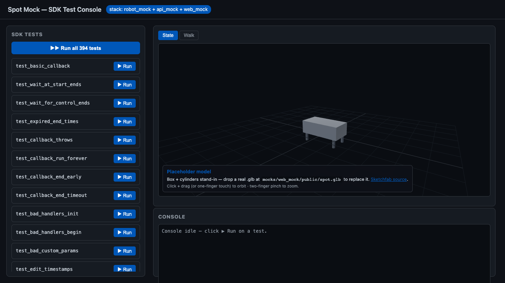

# spot-sdk-mock



> Recorded with Playwright against the live local stack — `docker compose up` then
> `cd tests/playwright && npx playwright test capture_demo.spec.ts && python ../../scripts/make_gif.py`.

A three-tier sandbox that lets you exercise the upstream Spot SDK test suite
in a browser, with no real robot required. Three services compose the stack:

| Service     | Folder         | Port  | Tech                    |
|-------------|----------------|-------|-------------------------|
| robot_mock  | `robot_mock/`  | 44444 | Python · gRPC           |
| api_mock    | `api_mock/`    | 3001  | TypeScript · Express    |
| web_mock    | `web_mock/`    | 4000  | React · Vite · Three.js |

## Layout

```
spot-sdk-mock/
  docker-compose.yml
  conftest.py             # root pytest shim — registers --mock for the vendor suite
  pytest.ini              # testpaths + pythonpath for the upstream tests
  README.md
  .gitignore
  mocks/                  # all mock services live under one umbrella
    robot_mock/           # Python gRPC mock Spot (folder *is* the Python package)
      Dockerfile
      pyproject.toml
      __init__.py
      server.py
      state.py
      servicers/
      tests/              # mock_robot's own service-level tests
    api_mock/             # Express/TS API
      Dockerfile
      eslint.config.js
      src/{index.ts, routes/*.ts, grpc/client.ts}
      helpers/            # python helpers: scrape_manifest.py, robot_mock_helpers/*
    web_mock/             # React + Vite + Three.js SPA (Redux Toolkit)
      Dockerfile
      eslint.config.js
      public/spot.glb     # (optional) Sketchfab Spot model dropped here
      src/{App.tsx, components/*.tsx, store/*.ts}
  vendor/
    spot-sdk/             # pinned Boston Dynamics SDK submodule (read-only)
  k8s/                    # Deployments, Services, Ingress (resource names use
                          #   hyphens — DNS-1123 forbids underscores)
  tests/
    playwright/           # end-to-end Playwright specs (smoke + mission_smoke)
```

> Folder + Docker service + npm package names are **all snake_case**.
> Kubernetes resource names use hyphens because DNS-1123 doesn't allow
> underscores — that's a platform constraint, not a project style choice.

## Run locally (docker compose)

```bash
docker compose up --build
```

Once up:

- `curl -s http://localhost:3001/api/health` → `{"status":"ok"}`
- `curl -s http://localhost:4000` → HTTP 200, the React app
- Open `http://localhost:4000` in a browser to drive tests interactively.

## Smoke test

```bash
cd playwright
npm install
npx playwright install chromium
npx playwright test smoke.spec.ts
```

The smoke spec asserts:
1. Page title contains "Spot Mock"
2. At least one SDK test card renders
3. The Three.js robot canvas mounts
4. Clicking ▶ Run streams console output within 30 s

## Deploy to Kubernetes

```bash
kubectl apply -f k8s/
# (uses local images by default; build & push spot-sdk-mock/{robot-mock,api-mock,web}:latest first)
```

The Ingress routes `/api/*` to `api-mock` and `/` to `web`. Set your DNS or
`/etc/hosts` to point `spot-mock.local` at the cluster's ingress IP.

## Architecture

```
  ┌────────────┐    REST + SSE    ┌────────────┐   gRPC (proto)   ┌────────────┐
  │    web     │ ───────────────► │  api_mock  │ ────────────────►│ robot_mock │
  │ Vite/React │ ◄─ JSON, stream  │ Express/TS │ ◄─ RobotState pb │  Python    │
  └────────────┘                  └────────────┘                  └────────────┘
        :4000                          :3001                          :44444
```

- **robot_mock** speaks the full `bosdyn.api` surface clients need: `RobotId`,
  `Auth`, `Directory`, `TimeSync`, `EStop`, `Lease`, `Power`, `RobotCommand`,
  `RobotState`, `Image`, `DirectoryRegistration`. It listens insecure on 44444.
- **api_mock** does three things: scrapes `vendor/spot-sdk/python/**/tests/test_*.py`
  into a manifest at startup (Python AST), exposes a `POST /api/tests/run` SSE
  endpoint that shells out to `pytest … --mock`, and proxies `/api/robot/state`
  over gRPC.
- **web** renders the test list, a Three.js Spot avatar driven by
  `/api/robot/state`, and a streaming console pane.

## Spot SDK as a submodule

The upstream Spot SDK lives at `vendor/spot-sdk/` as a pinned git submodule
(no test files are copied into this repo — the submodule is the single
source of truth). After cloning:

```bash
git submodule update --init --recursive
```

A root-level `conftest.py` and `pytest.ini` route all upstream tests at the
local `robot_mock` server when `--mock` is passed; without the flag, tests
behave exactly as they do when run standalone inside the submodule.

```bash
# Run every upstream test against the mock
pytest vendor/spot-sdk/python/bosdyn-client/tests/ \
       vendor/spot-sdk/python/bosdyn-mission/tests/ -v --mock

# Run a single upstream test
pytest vendor/spot-sdk/python/bosdyn-mission/tests/test_client.py -v --mock

# Confirm the submodule is at the expected pinned commit
git submodule status
```

## Adding a new SDK test

Tests are not added in this repo — they belong upstream in
`boston-dynamics/spot-sdk`. To pull in a new upstream version:

```bash
cd vendor/spot-sdk
git fetch origin
git checkout <new-tag-or-commit>
cd ../..
git add vendor/spot-sdk && git commit -m "bump spot-sdk to <ref>"
```

Restart `api_mock` afterwards so the manifest re-scrapes the new tests.

## Configuration

| Variable          | Where        | Default                 | Purpose                                   |
|-------------------|--------------|-------------------------|-------------------------------------------|
| `MOCK_ROBOT_PORT` | robot_mock   | 44444                   | Override server port                      |
| `ROBOT_MOCK_HOST` | api_mock     | `robot_mock`            | Hostname of gRPC peer                     |
| `ROBOT_MOCK_PORT` | api_mock     | 44444                   | Port of gRPC peer                         |
| `PORT`            | api_mock     | 3001                    | API listen port                           |
| `VITE_API_BASE`   | web          | `http://localhost:3001` | API origin (only env the web app reads)   |

## Running tests outside the stack

```bash
# Python service-level tests for the mock itself
pytest robot_mock/tests/ -v

# Upstream SDK suite, routed through robot_mock when --mock is passed
pytest vendor/spot-sdk/python/bosdyn-client/tests/ \
       vendor/spot-sdk/python/bosdyn-mission/tests/ -v --mock
```

`--mock` is registered in the root-level `conftest.py`; without it the
upstream tests behave exactly as they do when run inside the submodule.

## Constraints respected

- `vendor/spot-sdk/` is a read-only submodule — no file inside it is ever
  modified. The root `conftest.py` + `pytest.ini` are the only shims.
- `VITE_API_BASE` is the single GUI env var.
